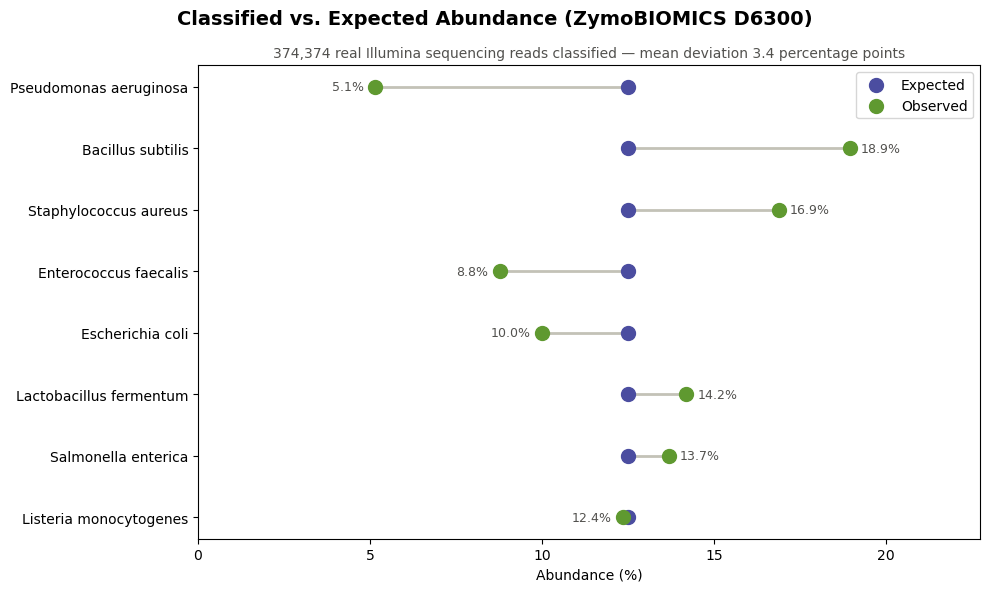

## Sequence to Taxa Processor

A from-scratch metagenomic taxonomic classifier: given raw DNA sequencing
reads (FASTA/FASTQ) and a set of reference genomes, classify each read to
its most likely species of origin using k-mer matching all in Python.

The tool is general-purpose and bring-your-own-data: point it at any folder
of reference genomes and any read file via CLI arguments. It does not
hardcode a specific species or dataset.

### Installation

```bash
pip install -r requirements.txt
```

### Quickstart

`src/pipeline.py` is the recommended entry point. It chains
build -> classify -> diversity -> plot in one command, and stops at the
first stage that fails instead of continuing on bad output:

```bash
python src/pipeline.py \
  --genome-dir data/reference/Genomes \
  --reads path/to/reads.fastq \
  --output-dir results/ \
  --k 21 \
  --source SRA
```

Everything it produces (index, classifications CSV, SQLite database,
diversity report, species-abundance CSV, abundance plot) lands in
`--output-dir`. A few flags worth knowing about:

- `--index path/to/kmer_index.pkl` reuses an existing index instead of
  rebuilding it. It's independent of `--genome-dir`. If you pass both,
  the genomes still get loaded for the GC-outlier check below, they just
  aren't used to rebuild the index.
- `--min-quality 20` drops FASTQ reads whose mean Phred quality (Phred+33)
  is below the threshold before classifying. FASTQ only, it'll raise if
  you use it on a FASTA file.
- `--top-n 10` controls how many species get plotted individually before
  the rest collapse into "Other" (default: 10).
- `--skip-plot` skips the plotting stage.

If `--genome-dir` is given, those reference genomes also get checked for
GC-content outliers (`src/qc.py`). You'll see a warning if a species'
genome GC% is a statistical outlier relative to the rest of the reference
set, since that's a plausible contributor to abundance skew (see
"Validated accuracy" below).

Each stage still works standalone if you want more control over an
individual step: `src/build_reference.py`, `src/classify_reads.py`
(also takes `--min-quality`), and `src/diversity_report.py`. Run any of
them with `--help` for their options.

### How it works

- **k-mer indexing**: every reference genome is broken into overlapping
  k-mers (default k=21) and indexed as `{kmer: set of species}`.
- **Classification**: each read is broken into the same k-mers, and the
  species with the most matching k-mers wins ("top hit"), with a confidence
  score based on vote share.
- **Why k=21**: short k-mers (k=3/4) are statistically near-guaranteed to
  appear in many genomes by chance (DNA has only 4 letters), making them
  non-discriminating. Real tools like Kraken2 use k in the 21-35 range for
  the same reason.

### Validated accuracy

Classified 390,381 real Illumina reads (SRA accession SRR10391187, from the
ZymoBIOMICS D6300 mock community with 8 bacterial species at ~12% each) against
an 8-species reference index (k=21, 30.5M k-mers):

- All 8 expected species correctly detected, no phantom species
- 95.9% of reads classified (4.1% unclassified)
- Per-species abundance in the 4.9%–18.2% range (theoretical truth: 12%
  each) — deviations are explainable by genome size, GC content/sequencing
  bias, and ambiguous k-mer vote-sharing, not unexplained noise

### Validation graphic



Same validation run as above, plotted against the known ground truth. This
simply validates the tool's accuracy, it isn't a core component of the
pipeline. It only works because ZymoBIOMICS publishes an expected
composition to compare against, which your own data won't have.
Regenerate it after a fresh classification run with
`python scripts/plot_zymobiomics_validation.py` (dataset-specific, same
pattern as `scripts/investigate_pseudomonas_gc.py`).

### Performance baseline

End-to-end timing (index load + classification, not just classification in
isolation) on the 390,381-read / 30.5M-k-mer benchmark above:

- Index load: ~19–22s
- Classification: ~56–60s (~6,450–6,940 reads/sec)
- Total: ~80s

See `src/benchmark.py`.

### Docker

A `Dockerfile` is included (`python:3.13-slim`, entrypoint wraps
`pipeline.py`, reference genomes baked into the image). It hasn't been
built or run yet, so treat it as written but unverified rather than a
tested path:

```bash
docker build -t sequence-to-taxa-processor .
docker run --rm -v ${PWD}/results:/app/results sequence-to-taxa-processor \
  --genome-dir data/reference/Genomes \
  --reads /app/reads.fastq \
  --output-dir /app/results
```

### Repo structure

```
sequence-to-taxa-processor/
├── src/
│   ├── fasta_utils.py          # FASTA/FASTQ parsing, k-mer extraction
│   ├── classifier_functions.py # index building, read classification
│   ├── build_reference.py      # CLI: build a k-mer index from a genome folder
│   ├── classify_reads.py       # CLI: classify reads against a saved index
│   ├── diversity_report.py     # CLI: per-sample diversity report from the DB
│   ├── benchmark.py            # end-to-end performance benchmark
│   ├── database.py             # SQLite storage + abundance queries
│   ├── diversity.py            # species richness, Shannon diversity
│   ├── qc.py                   # GC-outlier check, read quality filtering
│   ├── visualization.py        # species-abundance-by-sample chart
│   └── pipeline.py             # CLI: unified build->classify->diversity->plot
├── data/
│   ├── reference/Genomes/      # example reference genomes (ZymoBIOMICS)
│   └── raw/sra_reads/          # example real read data (gitignored)
├── tests/                      # pytest suite (fasta_utils, classifier,
│                                #   database, diversity, qc, build_reference,
│                                #   classify_reads, visualization, pipeline)
├── docs/                       # static assets referenced by this README
├── Dockerfile                  # containerized pipeline.py entrypoint
└── requirements.txt
```

### Project status

- **Done**: core k-mer classifier, real FASTA/FASTQ parsing, SQLite storage
  with per-sample abundance queries, diversity metrics (species richness,
  Shannon index), GC-outlier and read-quality QC (`qc.py`), a
  species-abundance-by-sample visualization, a unified `pipeline.py` CLI,
  CI running the test suite on every push.
- **Written but unverified**: Docker containerization (see above).
- **Not yet started**: Nextflow workflow orchestration, cloud deployment,
  polished demo notebooks.

### Validation dataset

Validation (not core to the tool) uses the **ZymoBIOMICS Microbial Community
Standard (D6300)**, a commercially defined mock community with known
composition BioProject PRJNA587452, SRA accession SRR10391187. Reference
genomes for its 8 bacterial species are committed under
`data/reference/Genomes/`.
