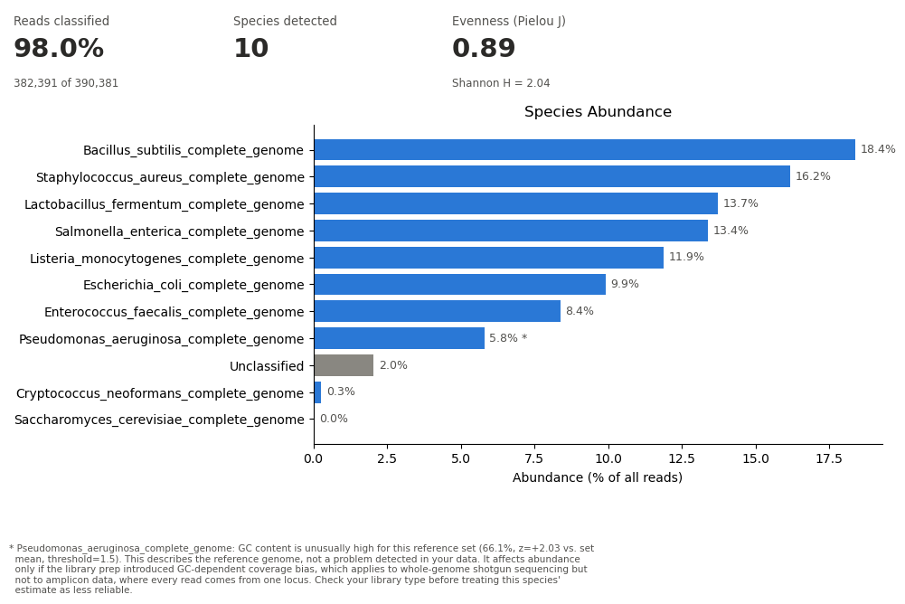

## Sequence to Taxa Processor

A from-scratch metagenomic taxonomic classifier: given raw DNA sequencing
reads (FASTA/FASTQ) and a set of reference genomes, classify each read to
its most likely species of origin using k-mer matching all in Python.

The tool is general-purpose and bring-your-own-data: point it at any folder
of reference genomes and any read file via CLI arguments. It does not
hardcode a specific species or dataset.

### Installation

```bash
pip install -r requirements.txt
```

### Quickstart

`src/pipeline.py` is the recommended entry point. It chains
build -> classify -> diversity -> plot in one command, and stops at the
first stage that fails instead of continuing on bad output:

```bash
python src/pipeline.py \
  --genome-dir data/reference/Genomes \
  --reads path/to/reads.fastq \
  --output-dir results/ \
  --k 21 \
  --source SRA
```

Everything it produces (index, classifications CSV, SQLite database,
diversity report, species-abundance CSV, abundance plot) lands in
`--output-dir`. A few flags worth knowing about:

- `--index path/to/kmer_index.pkl` reuses an existing index instead of
  rebuilding it. It's independent of `--genome-dir`. If you pass both,
  the genomes still get loaded for the GC-outlier check below, they just
  aren't used to rebuild the index.
- `--min-quality 20` drops FASTQ reads whose mean Phred quality (Phred+33)
  is below the threshold before classifying. FASTQ only, it'll raise if
  you use it on a FASTA file.
- `--top-n 10` controls how many species get plotted individually before
  the rest collapse into "Other" (default: 10).
- `--skip-plot` skips the plotting stage.
- `--redistribute` also writes a second, proportional vote-share
  abundance CSV alongside the normal winner-take-all one. Off by default,
  see "How it works" and "Validated accuracy" below for why.

If `--genome-dir` is given, those reference genomes also get checked for
GC-content outliers (`src/qc.py`). You'll see a warning if a species'
genome GC% is a statistical outlier relative to the rest of the reference
set. The warning describes the reference genome, not a problem found in
your data. Extreme GC only distorts abundance when the library prep
introduced GC-dependent coverage bias, which applies to whole-genome
shotgun sequencing and not to amplicon data.

Each stage still works standalone if you want more control over an
individual step: `src/build_reference.py`, `src/classify_reads.py`
(also takes `--min-quality`), and `src/diversity_report.py`. Run any of
them with `--help` for their options.

### How it works

- **k-mer indexing**: every reference genome is broken into overlapping
  k-mers (default k=21) and indexed as `{kmer: set of species}`.
- **Canonical k-mers**: DNA is double-stranded and a sequencer reports
  whichever strand it read, without saying which. Every k-mer is stored and
  looked up as `min(kmer, reverse_complement(kmer))`, so both strands of a
  fragment collapse onto one key and a read matches regardless of orientation.
  This is what Kraken2 and other k-mer classifiers do, for the same reason.
- **Classification**: each read is broken into the same k-mers, and the
  species with the most matching k-mers wins ("top hit"), with a confidence
  score based on vote share. A read is only assigned when one species holds
  the top count outright. If two or more species tie, the read is left
  unclassified rather than assigned by a tie-break, which keeps results
  reproducible across runs. Ties affect 0.15% of reads on the validation
  dataset below.
- **Why k=21**: short k-mers (k=3/4) are statistically near-guaranteed to
  appear in many genomes by chance (DNA has only 4 letters), making them
  non-discriminating. Real tools like Kraken2 use k in the 21-35 range for
  the same reason.
- **Vote redistribution (opt-in, `--redistribute`)**: alongside the
  per-read winner-take-all CSV, splits each read's k-mer votes
  proportionally across every species it hit, instead of giving the
  whole read to one winner. Off by default, it measures worse than
  winner-take-all on this dataset (see "Validated accuracy" below) - kept
  available for data where ambiguous multi-species reads are rare rather
  than the norm, e.g. true shotgun sequencing.

### Validated accuracy

Classified 390,381 real Illumina reads (SRA accession SRR10391187) against a
10-species ZymoBIOMICS D6300 reference index (k=21, 65.46M canonical k-mers).
2.05% of reads were unclassified.

SRR10391187 is 16S rRNA amplicon sequencing (confirmed via SRA's own run
metadata), so accuracy is measured against Zymo's 16S-adjusted theoretical
composition rather than a flat per-species split, since rRNA copy number varies
a lot between species:

| Species | Expected (16S) | Observed | Relative deviation |
|---|---|---|---|
| Lactobacillus fermentum | 18.4% | 14.01% | 23.9% |
| Bacillus subtilis | 17.4% | 18.78% | 7.9% |
| Staphylococcus aureus | 15.5% | 16.52% | 6.6% |
| Listeria monocytogenes | 14.1% | 12.13% | 14.0% |
| Salmonella enterica | 10.4% | 13.66% | 31.4% |
| Escherichia coli | 10.1% | 10.13% | 0.3% |
| Enterococcus faecalis | 9.9% | 8.56% | 13.5% |
| Pseudomonas aeruginosa | 4.2% | 5.92% | 40.9% |

Mean relative deviation across the 8 bacteria is 17.3%. Expected values are
Zymo's published "16S Only" column ([D6300 datasheet](https://files.zymoresearch.com/protocols/_d6300_zymobiomics_microbial_community_standard.pdf),
Table 1), which is rRNA-copy-number adjusted for standard bacterial primers.
The two yeasts come out at 0.27% and 0.03%; Zymo lists them as `NA` in that
column because bacterial 16S primers do not amplify fungal rRNA at all.

**Pseudomonas aeruginosa is the largest miss, and that is the expected
behaviour of this method.** Zymo's own bioinformatics appendix states that
conserved rRNA sequences cause reads from high-abundance microbes to be
assigned to low-abundance ones, "resulting in the overestimation of
low-abundance microbes in the standard". P. aeruginosa has the lowest
16S-adjusted expectation in the panel: Zymo's formula is
`16S share proportional to (DNA fraction / genome size) x copies per genome`,
and it has both the largest genome (6.792 Mb) and the fewest 16S copies (4).
It is the low-abundance species the appendix describes, and it is
overestimated.

The structural reason is visible in the data. 92.35% of reads match 8 of the
10 indexed species, and only 3.77% match exactly one. For almost every read the
classifier is choosing among species that all matched, on narrow k-mer vote
margins inside a conserved gene.

### Comparison of abundance estimation methods

Three methods were measured on the same run. All three are reproducible from
the saved `classifications.csv` via its `n_species_hit` column.

| Method | Mean relative deviation | Reads used |
|---|---|---|
| Winner-take-all (default) | 17.3% | 100% |
| Proportional vote redistribution (`--redistribute`) | 30.0% | 100% |
| Discarding ambiguous reads | 161.7% | 3.77% |

Redistribution splits each read's k-mer votes across every species it hit. It
does worse because when 92% of reads hit everything, proportional splitting
drives every estimate toward 1/8 = 12.5% and erases the signal.

Discarding reads that match more than one genome is the fix Zymo's appendix
suggests. It is by far the worst option here, because the uniquely-mapping
reads are not a representative sample: P. aeruginosa is 4.2% of the community
but 35.2% of them, while Staphylococcus aureus contributes 3 reads in total. On
amplicon data the only reads that map uniquely come from the most
phylogenetically distinct organism, so the remedy amplifies the bias it targets.

Winner-take-all is the default for this reason.

### A note on Zymo's <15% specification

Zymo's datasheet lists "Relative Abundance Deviation in Average - <15%" under
Specifications, alongside impurity level and cell concentration. It describes
how far a manufactured lot deviates from the theoretical table, measured by
Zymo's own shotgun sequencing and reported per-lot on a Certificate of
Analysis. It is a tolerance on the physical material, not a benchmark for an
analysis pipeline, and the datasheet sets no accuracy threshold for workflows.
Deviation measured here is therefore reported as a number, not scored against
that figure.

### Validation graphic


Same run as above, plotted against Zymo's 16S-adjusted composition and sorted
by relative deviation, matching the metric the subtitle reports. Yeasts aren't
included, no valid 16S target to compare them against. Not a core
part of the pipeline either; this only works because Zymo happens to
publish real reference data to check against. Regenerate it after a fresh
classification run with
`python docs/plot_zymobiomics_validation.py` (dataset-specific).

### User example plots

`abundance_plot.png` is what `pipeline.py` actually generates by default:
species ranked by abundance with an explicit "Unclassified" bar, under a row
of summary tiles. Reads classified gives the classification rate and the raw
read count the percentages rest on. Species detected gives richness, which
exceeds the number of bars whenever `--top-n` collapses the tail into
"Other". Evenness gives Pielou's J, the share of the maximum Shannon
diversity attainable with that many species, which unlike raw Shannon is
bounded 0 to 1 and comparable across samples with different species counts.
A reference genome flagged as a GC outlier gets a "*" on its bar and a
footnote naming the reason. None of this needs separate ground truth to
interpret:



Real output from the same 390,381-read ZymoBIOMICS run described above
(`python src/pipeline.py --genome-dir data/reference/Genomes --index
data/reference/kmer_index_canonical.pkl --reads
data/raw/sra_reads/SRR10391187_1.fastq --output-dir results/`). 2.05% of reads
were unclassified here; most samples classify cleanly against a reference set
that actually contains what's in them.

Multi-sample comparison (`plot_multi_sample_abundance()`, a stacked bar
across samples) exists in `visualization.py` and is used by
`diversity_report.py --plot`, but `pipeline.py` doesn't yet have a way to
accumulate multiple runs into one comparable database.
### Performance baseline

Full pipeline on the 390,381-read / 65.46M-canonical-k-mer benchmark above:

- Index load: ~50s
- Full pipeline (load, classify, database, diversity, plot): ~3m03s
- Index build from 10 genomes: ~3m25s

Canonicalizing costs roughly 120 microseconds per 301bp read at k=21, which
about doubles classification time against a forward-only index. That is the
price of matching reads on either strand.

Reproduce the classification stage with `src/benchmark.py`:

```bash
python src/benchmark.py   --index data/reference/kmer_index_canonical.pkl   --reads data/raw/sra_reads/SRR10391187_1.fastq   --k 21
```

`--sample-size N` classifies only the first N reads. Throughput on a small
sample runs higher than the full-run figure above, so quote the full run.

### Reproducibility

Classification is deterministic: two runs over the same reads and index
produce byte-identical `classifications.csv`, verified on the 390,381-read
benchmark against the canonical index (matching MD5). Ties are what used to
break this, and they are now left unclassified rather than resolved by set
iteration order (see "How it works" above). Ties affect 0.14% of reads here,
and that figure is recomputable from a saved run via the `n_species_hit`
column rather than being a number quoted from a one-off script.

### Docker

A `Dockerfile` is included (`python:3.13-slim`, entrypoint wraps
`pipeline.py`, reference genomes baked into the image).

```bash
docker build -t sequence-to-taxa-processor .
docker run --rm -v ${PWD}/results:/app/results sequence-to-taxa-processor \
  --genome-dir data/reference/Genomes \
  --reads /app/reads.fastq \
  --output-dir /app/results
```

### Repo structure

```
sequence-to-taxa-processor/
├── src/
│   ├── fasta_utils.py          # FASTA/FASTQ parsing, k-mer extraction
│   ├── classifier_functions.py # index building, read classification
│   ├── build_reference.py      # CLI: build a k-mer index from a genome folder
│   ├── classify_reads.py       # CLI: classify reads against a saved index
│   ├── diversity_report.py     # CLI: per-sample diversity report from the DB
│   ├── benchmark.py            # end-to-end performance benchmark
│   ├── database.py             # SQLite storage + abundance queries
│   ├── diversity.py            # species richness, Shannon diversity
│   ├── qc.py                   # GC-outlier check, read quality filtering
│   ├── visualization.py        # single-sample summary chart (pipeline default)
│   │                            #   + stacked multi-sample chart
│   └── pipeline.py             # CLI: unified build->classify->diversity->plot
├── data/
│   ├── reference/Genomes/      # example reference genomes (ZymoBIOMICS)
│   └── raw/sra_reads/          # example real read data (gitignored)
├── tests/                      # pytest suite (fasta_utils, classifier,
│                                #   database, diversity, qc, build_reference,
│                                #   classify_reads, visualization, pipeline)
├── docs/                       # portfolio assets referenced by this README,
│                                #   + the script that regenerates them
├── Dockerfile                  # containerized pipeline.py entrypoint
└── requirements.txt
```

### Project status

- **Done**: core k-mer classifier with canonical (strand-agnostic) k-mers,
  proportional vote-splitting for abundance estimates, real FASTA/FASTQ
  parsing, a versioned on-disk index format validated on load, SQLite storage
  with per-sample abundance queries and per-read ambiguity counts, diversity
  metrics (species richness, Shannon index), GC-outlier and read-quality QC
  (`qc.py`), a species-abundance-by-sample visualization, a unified
  `pipeline.py` CLI, CI running the test suite on every push, Docker
  containerization (see above).
- **Not yet started**: Nextflow workflow orchestration, polished demo
  notebooks.

### Validation dataset

Validation (not core to the tool) uses the **ZymoBIOMICS Microbial Community
Standard (D6300)**, a commercially defined mock community with known
composition, BioProject PRJNA587452, SRA accession SRR10391187. Reference
genomes for its 8 bacterial species and 2 yeast species are committed under
`data/reference/Genomes/`. The read data itself isn't committed (too
large); fetch it with `python docs/download_zymobiomics_reads.py`
(requires the SRA Toolkit's `prefetch`/`fasterq-dump` on PATH).
